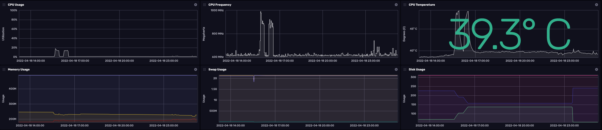

# sysmetrics

Publish basic system metrics to Influx Cloud



### Setup

- [Create a free Influx Cloud account](https://cloud2.influxdata.com/signup)
- Create an Influx Cloud Bucket (system-metrics) and API Token

### Usage

The following env variables are **required**:

- INFLUX_TOKEN: API Token provided by Influx Cloud
- INFLUX_ORG: Your Influx Cloud organization name
- INFLUX_BUCKET: Your Influx Cloud bucket name (Default: `system-metrics`)

Additional supported env variables include:

- DEBUG: Enable or disable in-app debug logging (Default: `False`)
- DEVICE: Preferred name for this device (Default: `My Device`)
- INFLUX_HOST: Host of the Influx Cloud bucket (Default: `https://us-central1-1.gcp.cloud2.influxdata.com`)

### Launch

The application can be launched with `docker-compose`:

```
docker-compose up -d
```

### Dashboard

A sample dashboard is provided in this repo and can be imported:

- Ensure that sysmetrics is running
- Login to Influx Cloud and go to Dashboards
- Use the dropdown on `Create Dashboard` to import the template